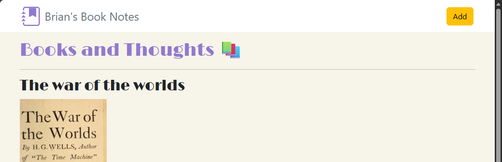
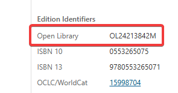
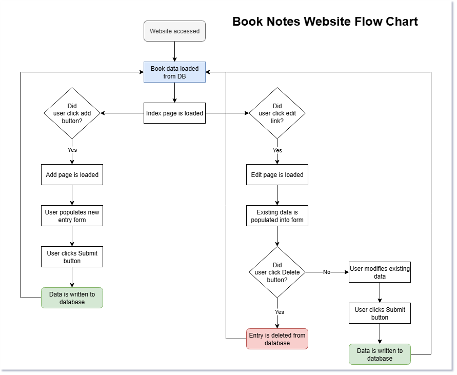

# WebDevBootcamp Capstone 5: Book Notes Website

## Overview
Capstone Number 5 for the Web Development Book camp provided an opportunity to combine knowledge learned in the previous lessons. The project demonstrates knowledge in the following areas:
-	Creating a web app with **Express** and **EJS**
-	Using **Axios** to work with **API requests**
-	Performing **CRUD operations** with **SQL** data
The *Book Notes website*, which was created, displays entries that have been added on the website’s home page. The website can also add new entries, modify entries, and delete data from the website. 

Although I did not necessarily use Axios to perform API requests, the Open Library was used to retrieve book covers for books that are added to the website. Since the only information needed to retrieve a book cover was the **OLID number**, that value was passed into a string to query the necessary URL to obtain the book’s image.

This project is like the [Blog Website capstone project](https://github.com/briansalazar-tech/WebDevBootcamp-Capstone3-BlogWebsite) in the course, except this project works with persistent data. Initially, temporary testing data is used to verify the website’s functionality. Afterwards, SQL data is loaded into the website to ensure that the data the user interacts with remains persistent if the website were to be restarted.

### Potential improvements
This website provided an excellent opportunity to put a riff on the concepts covered in the previous sections, highlighting using SQL to interact with persistent data. 

Some potential upgrades that can be introduced in later iterations include:
1.	Utilizing Axios to make actual API requests vs navigating to the image file URL.
2.	Displaying further details for a book by rendering a Books information on its own individual page.
3.	Add multi-user capabilities.
4.	Add security. Currently, anyone can delete and add data to the SQL database.

## Technologies & Modules Used
### Technologies
#### Open Library Database
The [Open Library](https://openlibrary.org/) database is used to retrieve book covers for books that a user adds to the website. The project asked to use the [API](https://openlibrary.org/dev/docs/api/covers) to complete this task; however, this app accesses the book URL directly by retrieving a book’s OLID number. This number can be retrieved by searching for a book on the Open Library website.

#### PostgreSQL
**PostgreSQL** is used to create a SQL database to persist data on this website. SQL and Postgres were the main focuses of the previous sections in the Web Development Bootcamp course.
### Modules
#### Express & EJS
**Express** and **EJS** are used to render routes for the website and load data onto the website, including the header and JavaScript data. 
#### BodyParser
**Bodyparser** is used to interact with data that is retrieved.
#### Dotenv
**Dotenv** is used to load environment variables. This project only has one environment variable, the database password.
#### Pg
**Pg** is used to interact with PostgreSQL data. This includes performing all of the CRUD operations needed to make the website function.

## Routes and Functionality
### Home Page (Reading SQL data)
The home page displays the data that is stored in the project's database. On this page, entries are loaded from the SQL database using a for loop that displays the following information for each entry:
-	The book’s title
-	The book’s cover
-	A recommendation score
-	Date the book was read
-	A user summary of the book being displayed

At the top of the pages, users are also able to add new entries and access the add route.

On each individual entry, there is a link called “edit/delete”. This link loads the edit entry route and passes data to the route based on the entry's ID value, which is loaded from the database.

### Add Entry Page (Creating SQL data)
The add route allows a user to add new entries to the website. When a user accesses this page, a user is presented with a form to be filled out. The values provided on this page are used to construct a new database entry. When the user hits the submit button, the entry is saved to the database, and the user is redirected to the website’s home page.

### Edit Entry Page (Update SQL data)
When a user clicks on the edit/delete link, they are redirected to the edit entry page. 

The page presents the same form as the add entry page. However, data for the selected entry is passed into the page, and the form’s fields are prepopulated with the saved data. A user can change any of the data that is passed into this form or leave it the same. Once the user clicks the submit button, the data on the form overwrites the current data that is saved in the database.

With the changes saved, the user is redirected to the website’s home page, reflecting the changes.

### Delete Route (Delete SQL data)
The delete route is accessed when a user clicks on an entry to edit. At the bottom of the page, there is a button to delete the saved entry. When a user clicks on this button, the database entry is deleted, and the user is redirected to the website’s home page, reflecting the changes.

## Project Flowchart
The flow chart below highlights the logic behind how the website functions.

## Screenshots
Screenshots for this project can be found in the [ProjectScreenshots](./ProjectScreenshots) folder. Screenshots included include:
- Book Notes website page
- Add entry page
- Edit entry page
- Starting SQL database data
- Updated SQL database data